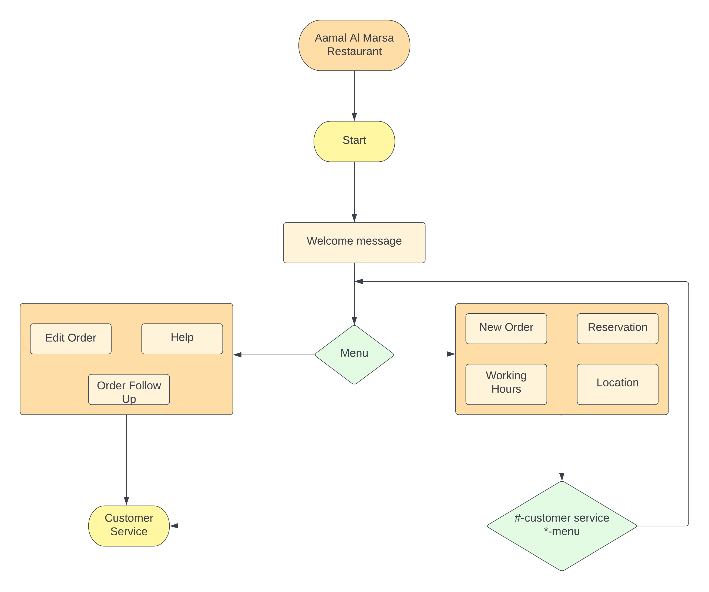

# **Aamal Holding** 
# Al Masra Restaurant

## 1. Code Explanation

The first line of the code will always be <br>

`function onMessageReceive()`
<br>

This function is called whenever the first message of the session is passed 

```javascript
function onMessageReceive(){
  return $.reply({
    text :  {
      body : "\n مربا بكم في مطعم المرسى  \n Welcome to Al Marsa Restaurant \nالرجاء اختيار اللغة   \nPlease select:"
     },
     options : {
       buttons : ["Urdu","English"]
     }
  }).listen({
    text : "Urdu",
    handler : hindiHandler  
  },{
    text : "English",
    handler : englishHandler 
  },otherHandle); // If answer is none of the above, this is default handler
}
```
`$.reply({})` <br>
It is a function used to give reply to the user and has the attribute text

`text:
{ body:{},
options:{} }`
<br>
The text attribute contains body where the body of the message to be sent is specified. And the options contain the buttons which need to be displayed along with the message.

`.listen({})`<br>
listen is a special function that checks the input text of the user and assigns various tasks to it. It has two attributes namely text and handler.

`handler:` <br>
As you can see in the above code, after any button is selected the various handlers are being called. These handlers are the functions which have their own specific tasks. While there are speicific texts for specific handlers to be passed, if none of the given texts are passed, otherHandle will be called.

>The above function specifies the content of the first message to be appeared on the chat screen. The output will be seen as below:
>
><!--  -->
>

<hr>
<br>
Now let us look at one of the handlers and it's code. Say for eg, we'll look at englishHandler

```javascript
function englishHandler() {
  $.reply({
    text :  {
      body : "Our Servies. \n Please Select the required service:"
     },
    options : {
       buttons : ["New Order","Edit Order", "Reservation", "Order Follow Up", "Our Location", "Working Hours", "Help"]
     }
    
  }).listen({
    text : "New Order",
    handler : neworderhandler  
  },
  {
    text : "Edit Order",
    handler : connecttoagenthandler 
  },
  {
    text : "Reservation",
    handler: reservationhandler
  },
  {
    text : "Order Follow Up",
    handler : connecttoagenthandler
  },
  {
    text : "Our Location",
    handler : ourlocationhandler
  },{
    text : "Working Hours",
    handler : workinghourshandler
  },{
    text : "Help",
    handler : connecttoagenthandler
  },otherHandle);
}
```
Here, the englishhandler is called if English is typed or selection after the first function. This in turn has a menu and passed different handlers on different outputs.

>The englishHandler will look like this
>
<hr>
<br>

Now let us look at one of the funtions, but instead of brute writing code, we will call a template here.
```javascript
function workinghourshandler()
{
  $.reply({
  template: {
    code: "aamal_workinghours",
    lang: "en_US"
  }
  }).listen({
    text : "*",
    handler : englishHandler 
  },
  {
    text : "#",
    handler : connecttoagenthandler
  },otherHandle);
}
```
`* and # `
<br> Typing * redirects to the main menu and # connects the user to an agent

`template:{}`
<br>
It refers to the HSM template created on your domain and direcly calls it. The template has all the attribute and is easier to use. 
<br>The template is as follows:

>The reply will be
>
<br>
<hr>
<br>

## 2. Workflow of the bot


<br>
<hr>
<br>

## 3. Demo 
The demo video link is 
<br>
[Demo](https://drive.google.com/file/d/1ayVqOQEyCVOkxwwRD7a5F0AGSrFzlQeY/view?usp=sharing)
<br>
<hr>
<br>

## 4. Code
The complete code can be found below
```javascript
function onMessageReceive(){
  return $.reply({
    text :  {
      body : "\n مربا بكم في مطعم المرسى  \n Welcome to Al Marsa Restaurant \nالرجاء اختيار اللغة   \nPlease select language:"
     },
     options : {
       buttons : ["Urdu","English"]
     }
  }).listen({
    text : "Urdu",
    handler : hindiHandler  
  },{
    text : "English",
    handler : englishHandler 
  },otherHandle); // If answer is none of the above, this is default handler
}
function hindiHandler() {
  $.reply({
    body : "Hi, I am good how are you?"
  });
}
function englishHandler() {
  $.reply({
    text :  {
      body : "Our Servies. \n Please Select the required service:"
     },
    options : {
       buttons : ["New Order","Edit Order", "Reservation", "Order Follow Up", "Our Location", "Working Hours", "Help"]
     }
    
  }).listen({
    text : "New Order",
    handler : neworderhandler  //If answer is "Good"
  },
  {
    text : "Edit Order",
    handler : connecttoagenthandler //If answer is "Bad"
  },
  {
    text : "Reservation",
    handler: reservationhandler
  },
  {
    text : "Order Follow Up",
    handler : connecttoagenthandler
  },
  {
    text : "Our Location",
    handler : ourlocationhandler
  },{
    text : "Working Hours",
    handler : workinghourshandler
  },{
    text : "Help",
    handler : connecttoagenthandler
  });
}
function otherHandle(){
  return $.reply({
    text :  {
      body : ` ${inbound.getText()} is a invalid input.`  // Read Customer input
     }
  });
}


function reservationhandler(){

  return $.reply({
    text :  {
      body : "Reservaion \n\nYou can honor us by making a personal reservation \nTo return the main menu,  please send * \nTo speak with a customer service representative, please send # \n \nClick on below URL \nhttps://www.arabirestaurant.com"// Read Customer input
     }
     
  }).listen({
    text : "*",
    handler : englishHandler //If answer is "Good"
  },
  {
    text : "#",
    handler : connecttoagenthandler
  },otherHandle);
}

function neworderhandler(){
  return $.reply({
    text :  {
      body : "New order \n \nTo return the main menu,  please send * \nTo speak with a customer service representative, please send # \n \nClick on below URL \nhttps://www.arabirestaurant.com"// Read Customer input
     }
     
  }).listen({
    text : "*",
    handler : englishHandler //If answer is "Good"
  },
  {
    text : "#",
    handler : connecttoagenthandler
  },otherHandle);
}

function connecttoagenthandler(){
  $.reply({
    text :  {
      body : "Thank you, Customer service will contact you as soon as possible."// Read Customer input
     }
     
  });
  $.route.to.team("intern");
  
}

function ourlocationhandler()
{
  return $.reply({
    text :  {
      body : "Our Location \n \nTo return the main menu,  please send * \nTo speak with a customer service representative, please send # \n \nBneid Al-Gar \nhttps://goo.gl/maps/ZRfY8EsdbvZ4Yv957 \n \nSalmiya \nhttps://goo.gl/maps/V9FoP9fKqh7KP5Xm9 \n \nSabah Al-Salem \nhttps://goo.gl/maps/Hb1TRh8cyzXz1PYz7 \n \nMahboula \nhttps://goo.gl/maps/z2GTAKQQpYZF4CCdA \n \nShamiya \nhttps://goo.gl/maps/nUK2Q1JQRb4ChmFq9 \n \nJahra-Sulaiyel Mall \nhttps://goo.gl/maps/6ReSvUUDaeYSfdnT8"  // Read Customer input
     }
  }).listen({
    text : "*",
    handler : englishHandler //If answer is "Good"
  },
  {
    text : "#",
    handler : connecttoagenthandler
  },otherHandle);
}


function workinghourshandler()
{
  $.reply({
  template: {
    code: "aamal_workinghours",
    lang: "en_US"
  }
  }).listen({
    text : "*",
    handler : englishHandler //If answer is "Good"
  },
  {
    text : "#",
    handler : connecttoagenthandler
  },otherHandle);
}

// function workinghourshandler()
// {
//   return $.reply(
//     {
//       "channelId": "aamal_ourlocation",
   
//   "type": "template",
//   "template": {
//     "data": {
//       "amount": 10,
//       "currency": "INR"
//     },
//     "id": "60d236c6142e53561cb7716c"
//   }

      
      
//     // template :  {
//     // code : "aamal_workinghours", // code of the template is mentioned where we can call the global variable value
//     // data: {
//     //   deliverytemp : delivery
//     // }
//     // }
//   }).listen({
//     text : "*",
//     handler : englishHandler 
//   },
//   {
//     text : "#",
//     handler : connecttoagenthandler
//   },otherHandle);
// }
  
  // return $.reply({
  //   text :  {
  //     body : "Working Hours \n8 AM - 12:00 AM \n \nTo return the main menu,  please send * \nTo speak with a customer service representative, please send #"  // Read Customer input
  //   }
  // }).listen({
  //   text : "*",
  //   handler : englishHandler //If answer is "Good"
  // },
  // {
  //   text : "#",
  //   handler : connecttoagenthandler
  // },otherHandle);

```